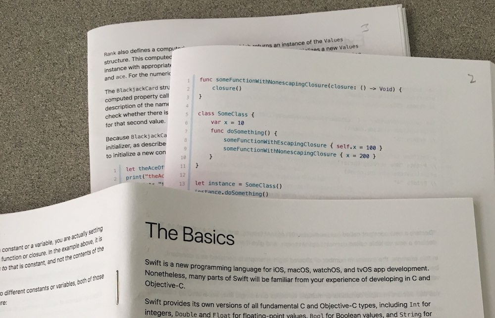

## Swift Book PDF

This project offers

* PDF versions of the [Swift Language Guide](https://docs.swift.org/swift-book/LanguageGuide/TheBasics.html) book. 
* A script for downloading and transforming the html from Swift's site into one big html file. This prints nicely to a PDF using your browser.
* Swift Language Guide on one html file (great for easy searching).

##### Purpose

The world needs a nice paper version of the Swift Language Guide, it's terrific documentation and a paper version is much easier to learn from. The epub version from Apple doesn't print well, this html->pdf route looks much better.

### Grab and go 

##### Full page PDFs

[Letter size PDF](https://github.com/joshmangum/swift-language-guide-pdf/releases/download/v2018-09-17/Letter_The_Swift_Programming_Language_Guide_4.2.pdf) 

[A4 size PDF](https://github.com/joshmangum/swift-language-guide-pdf/releases/download/v2018-09-17/A4_The_Swift_Programming_Language_Guide_4.2.pdf)

##### Booklets PDF

The Booklets PDF is for printing double sided, double page booklets of the book. The whole book is printed as four booklets, each should be folded in half and stapled along the fold. In the PDF, there is a blank page between each booklet.

Printed, they look like this:




  - [Booklets PDF](https://github.com/joshmangum/swift-language-guide-pdf/releases/download/v2018-09-17/Booklet_The_Swift_Programming_Language_Guide_4.2.pdf)

#### View as one html page

Viewing the whole book in one html page is really nice for searching. To view in your browser, download the repo, then in the repo directory type

```
> cd <revision date>/final/docs.swift.org/swift-book/
> python -m http.server 8080
```
`<revision date>` refers to the swift documentation version update from it's revision history page. You probably want the latest one. If there's a newer one at swift.org, you can create a new version by following [Recipes](recipes.md).

Then open http://localhost:8080/LanguageGuide/WholeBook.html in your browser


### How to

Want something slightly different? Need an update?

[Recipes](recipes.md) explains how to go from scraping the Swift site to generating the PDFs.

Happy to accept pull requests. Design changes, script improvements, everything is welcome.

### Credits

Orginal by Apple under [Creative Commons Attribution 4.0 International (CC BY 4.0) License](https://creativecommons.org/licenses/by/4.0/).

Offered under the same license.
